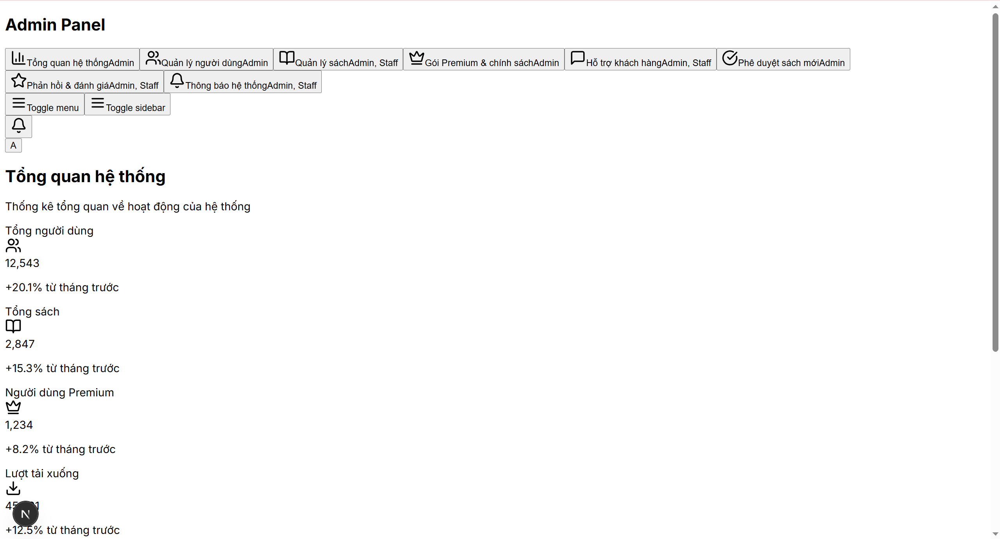

# Booklify Admin Dashboard

A modern, responsive admin dashboard for the Booklify ebook management platform built with Next.js 14, TypeScript, and Tailwind CSS.



## 🚀 Features

### Authentication & Security
- JWT-based authentication with persistent sessions
- Role-based access control (Admin/Staff)
- Protected routes with middleware
- Automatic token refresh

### Staff Management
- Complete CRUD operations for staff members
- Search and filter functionality
- Pagination support
- Role assignment and management

### Book Management
- Full book catalog management with API integration
- Advanced filtering (title, author, category, premium status)
- Sorting by multiple criteria (title, author, rating, views)
- Cover image display and file upload support
- Book approval workflow (pending/approved/rejected)
- Premium book management

### Category Management
- Card-based category display (no table view)
- Category creation and management
- Filter by status and search by name/description
- Pagination and sorting capabilities

### UI/UX Features
- Modern, responsive design with Tailwind CSS
- Dark/light mode support
- Toast notifications for all actions
- Loading states and error handling
- Mobile-friendly interface
- Custom SimpleSelect component (hydration-safe)

## 🛠️ Tech Stack

- **Framework**: Next.js 14 with App Router
- **Language**: TypeScript
- **Styling**: Tailwind CSS
- **UI Components**: Radix UI + Custom components
- **State Management**: Redux Toolkit
- **Authentication**: JWT tokens
- **Icons**: Lucide React
- **Package Manager**: npm/pnpm

## 📦 Installation

1. **Clone the repository**
   ```bash
   git clone https://github.com/your-username/booklify-admin-dashboard.git
   cd booklify-admin-dashboard
   ```

2. **Install dependencies**
   ```bash
   npm install
   # or
   pnpm install
   ```

3. **Environment setup**
   Create a `.env.local` file:
   ```env
   NEXT_PUBLIC_API_BASE_URL=https://booklify-api-fhhjg3asgwhxgfhd.southeastasia-01.azurewebsites.net/api/cms
   ```

4. **Run the development server**
   ```bash
   npm run dev
   # or
   pnpm dev
   ```

5. **Open your browser**
   Navigate to [http://localhost:3000](http://localhost:3000)

## 🔧 Configuration

### API Integration
The dashboard integrates with the Booklify API for:
- Authentication (`/auth/login`)
- Staff management (`/staff/*`)
- Book management (`/books/*`)
- Category management (`/book-categories/*`)

### Component Structure
```
components/
├── admin/                  # Admin-specific components
│   ├── book-management.tsx
│   ├── category-management.tsx
│   ├── staff-management.tsx
│   └── create-*-modal.tsx
├── auth/                   # Authentication components
│   ├── auth-guard.tsx
│   └── login-form.tsx
└── ui/                     # Reusable UI components
    ├── simple-select.tsx   # Custom select component
    ├── toaster.tsx         # Global toast notifications
    └── ... (other UI components)
```

## 🎯 Key Features Walkthrough

### 1. Login & Authentication
- Secure login with email/password
- JWT token management
- Role-based dashboard access
- Auto-redirect to appropriate sections

### 2. Book Management
- **List View**: Comprehensive table with cover images, ratings, and metadata
- **Filters**: Search by title/author, filter by category/premium status
- **Sorting**: Multiple sort options (date, rating, views, etc.)
- **Actions**: View, edit, approve/reject, delete books
- **Upload**: Support for PDF, EPUB, DOCX, TXT files (max 50MB)

### 3. Category Management
- **Card Layout**: Clean card-based interface (no table view)
- **Search**: Filter by name and description
- **Status Management**: Active/inactive category control
- **Responsive**: Mobile-friendly card grid

### 4. Staff Management
- **User Roles**: Admin and Staff role assignment
- **Search & Filter**: Find staff by name, email, or role
- **Pagination**: Handle large staff lists efficiently
- **Status Control**: Enable/disable staff accounts

## 🔐 Permissions & Roles

### Admin Role
- Full access to all features
- Staff management
- Book approval/rejection
- Category management
- System settings

### Staff Role
- Book management (limited)
- View-only access to some sections
- Cannot manage other staff members

## 🌐 API Endpoints

### Authentication
- `POST /auth/login` - User login

### Books
- `GET /books/list` - Get books with filters/pagination
- `POST /books` - Create new book
- `PUT /books/{id}/status` - Update book status

### Categories
- `GET /book-categories/list` - Get categories with filters
- `POST /book-categories` - Create new category

### Staff
- `GET /staff/list` - Get staff with filters/pagination
- `POST /staff` - Create new staff member

## 🚀 Deployment

### Build for Production
```bash
npm run build
npm start
```

### Environment Variables
Ensure all required environment variables are set:
- `NEXT_PUBLIC_API_BASE_URL`
- Any additional API keys or configurations

## 🤝 Contributing

1. Fork the repository
2. Create a feature branch (`git checkout -b feature/amazing-feature`)
3. Commit your changes (`git commit -m 'Add amazing feature'`)
4. Push to the branch (`git push origin feature/amazing-feature`)
5. Open a Pull Request

## 📝 Development Notes

### Custom Components
- **SimpleSelect**: Custom select component to avoid Radix UI hydration issues
- **Toast System**: Global notification system integrated throughout the app
- **AuthGuard**: Wrapper component for protected routes

### State Management
- Redux Toolkit for global state
- Authentication state persistence
- API response caching

### Styling
- Tailwind CSS with custom design system
- CSS custom properties for theming
- Responsive breakpoints for mobile optimization

## 📄 License

This project is licensed under the MIT License - see the [LICENSE](LICENSE) file for details.

## 🐛 Known Issues

- None currently reported

## 📞 Support

For support and questions:
- Create an issue on GitHub
- Contact the development team

---

**Built with ❤️ for the Booklify platform**
